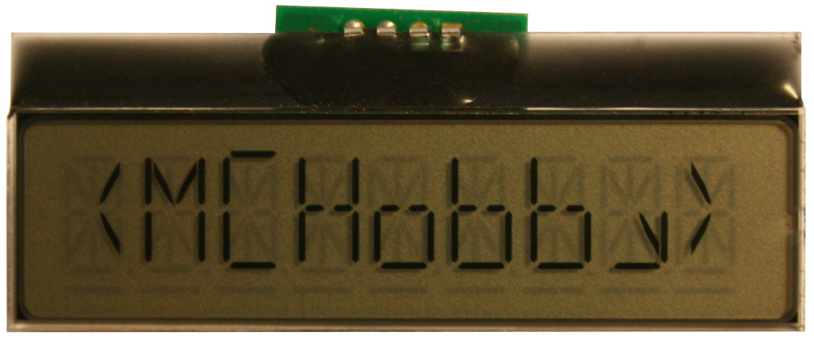

# Use an Olimex MOD-LCD1x9 with ESP8266 under MicroPython

MOD-RGB est un afficheur LCD Alphanumerique 9 position d'Olimex utilisant le port UEXT. 




Cette carte expose
* toto
* Un bus I2C
* Un connecteur UEXT pour faciliter le raccordement

__Où acheter__
* Shop: [UEXT RGB Module (MOD-RGB)](http://shop.mchobby.be/product.php?id_product=1414)
* Shop: [Module WiFi ESP8266 - carte d'évaluation (ESP8266-EVB)](http://shop.mchobby.be/product.php?id_product=668)
* Shop: [UEXT Splitter](http://shop.mchobby.be/product.php?id_product=1412)
* Shop: [Câble console](http://shop.mchobby.be/product.php?id_product=144)
* Wiki: not defined yet 

# ESP8266-EVB sous MicroPython
Avant de se lancer dans l'utilisation du module MOD-IO sous MicroPython, il faudra flasher votre ESP8266 en MicroPython.

Nous vous recommandons la lecture du tutoriel [ESP8266-EVB](https://wiki.mchobby.be/index.php?title=ESP8266-DEV) sur le wiki de MCHobby.

Ce dernier explique [comment flasher votre carte ESP8266 avec un câble console](https://wiki.mchobby.be/index.php?title=ESP8266-DEV).

## Port UEXT

Sur la carte ESP8266-EVB, le port UEXT transport le port série, bus SPI et bus I2C. La correspondance avec les GPIO de l'ESP8266 sont les suivantes.


# MOD-LCD1x9 Raccordement

Pour commencer, j'utilise un [UEXT Splitter](http://shop.mchobby.be/product.php?id_product=1412) pour dupliquer le port UEXT. J'ai en effet besoin de raccorder à la fois le câble console pour communiquer avec l'ESP8266 en REPL __et__ raccorder le module MOD-LCD1x9


# Code de test

## Bibliothèque modlcd19

Avant d'utiliser le script d'exemple, il est nécessaire de transférer la __bibliothèque modlcd19__ sur votre carte micropython.
* Copiez le fichier `modlcd19.py` sur la carte micropython.

Vous pouvez également transférer le script de test `test.py`  sur la carte PyBoard. 
La bibliothèque offre les fonctionalités suivantes

__Membres:__
* todo

__Methodes:__
* `todo`   : todo. 
 
## Exemple avec MOD-LCD1x9
```
# Utilisation du MOD-LCD1x9 d'Olimex avec un ESP8266 sous MicroPython
#
# Shop: [UEXT LCD1x9 board (MOD-RGB)](http://shop.mchobby.be/product.php?id_product=1414)
# Wiki: ---

todo
print( "That's the end folks")
```

## Exemple xxx
Contenu de l'exemple disponible dans le fichier `xxx.py`.

```
# Stress Test sur le MOD-LCD1x9 d'Olimex avec un ESP8266 sous MicroPython
#
# Shop: http://shop.mchobby.be/product.php?id_product=1414
# Wiki: ---

xxxx
print( "That's the end folks")
```

