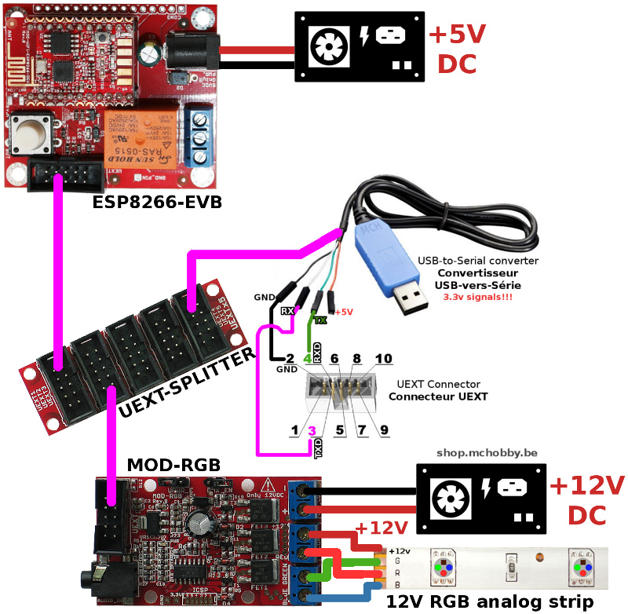

# Use an Olimex MOD-RGB with ESP8266 under MicroPython

MOD-RGB est une carte d'interface d'Olimex utilisant le port UEXT. 


Cette carte expose.
* Un FirmWare personnalisé pour bus I2C or DMX
* 3 canaux avec protection contre sur-courant
* Courant nominal par canal - 5A
* LEDs contrôlées par un signal PWM @ 1KHz
* Entrée Stéréo (jack)
* Cavalier pour sélection de mode DMX/I2C
* Cavalier pour alimenter la carte via UEXT
* Connecteur UEXT

__Où acheter__
* Shop: [UEXT RGB Module (MOD-RGB)](http://shop.mchobby.be/product.php?id_product=1410)
* Shop: [Module WiFi ESP8266 - carte d'évaluation (ESP8266-EVB)](http://shop.mchobby.be/product.php?id_product=668)
* Shop: [UEXT Splitter](http://shop.mchobby.be/product.php?id_product=1412)
* Shop: [Câble console](http://shop.mchobby.be/product.php?id_product=144)
* Wiki: not defined yet 

# ESP8266-EVB sous MicroPython
Avant de se lancer dans l'utilisation du module MOD-IO sous MicroPython, il faudra flasher votre ESP8266 en MicroPython.

Nous vous recommandons la lecture du tutoriel [ESP8266-EVB](https://wiki.mchobby.be/index.php?title=ESP8266-DEV) sur le wiki de MCHobby.

Ce dernier explique [comment flasher votre carte ESP8266 avec un câble console](https://wiki.mchobby.be/index.php?title=ESP8266-DEV).

## Port UEXT

Sur la carte ESP8266-EVB, le port UEXT transport le port série, bus SPI et bus I2C. La correspondance avec les GPIO de l'ESP8266 sont les suivantes.


# MOD-RGB Raccordement

Pour commencer, j'utilise un [UEXT Splitter](http://shop.mchobby.be/product.php?id_product=1412) pour dupliquer le port UEXT. J'ai en effet besoin de raccorder à la fois le câble console pour communiquer avec l'ESP8266 en REPL __et__ raccorder le module MOD-RGB



# Code de test

## Bibliothèque modrgb

Avant d'utiliser le script d'exemple, il est nécessaire de transférer la __bibliothèque modrgb__ sur votre carte micropython.
* Copiez le fichier `modrgb.py` sur la carte micropython.
* Copiez le fichier `rgbfx.py` (optionnel) sur la carte micropython.

Vous pouvez également transférer le script de test `test.py`  sur la carte PyBoard. A noter que les exemples `testfx.py`, `testoff.py` et `stress.py`

La bibliothèque offre les fonctionalités suivantes

__Membres:__
Aucun.

__Methodes:__
* `mod_rgb.pwm( enable )`   : True/False pour activer/désactiver la génération PWM LED. Lorsque qu'activé, la couleur est affichée sur le ruban. 
* `mod_rgb.audio( enable )` : True/False pour activer/désactiver les mode LED Audio.
* `mod_rgb.set_rgb( color )`: Fixe la couleur RGB avec un tuple RGB (rouge,vert,bleu) ayant des valurs entre 0 et 255.
* `mod_rgb.black()`         : Désactice toutes les LED (couleur noir). 
* `mod_rgb.board_id()`      : Retourne l'identification de la carte.
* `mod_rgb.change_address( 0x22 )` : Change l'adresse du module a 0x22 (à la place de 0x20).
                                   Le cavalier "prog" de programmation doit être fermé pendant l'envoi de la commande!
 
## Exemple avec MOD-RGB
```
# Utilisation du MOD-RGB d'Olimex avec un ESP8266 sous MicroPython
#
# Shop: [UEXT RGB board (MOD-RGB)](http://shop.mchobby.be/product.php?id_product=1410)
# Wiki: https://wiki.mchobby.be/index.php?title=MICROPYTHON-MOD-IO2

from machine import I2C, Pin
from time import sleep_ms
from modrgb import MODRGB

i2c = I2C( sda=Pin(2), scl=Pin(4) )
rgb = MODRGB( i2c ) # default address=0x20

# A color is code within a (r,g,b) tuple
# Set color to rose 
rgb.set_rgb( (255, 102, 204) )
sleep_ms( 5000 )

# Simple color suite
red=(255,0,0)
green=(0,255,0)
blue=(0,0,255)
color_suite = [red,green,blue,(255,255,255)]
for c in color_suite:
    rgb.set_rgb( c )
    sleep_ms( 2000 )

rgb.black()
print( "That's the end folks")
```

## Exemple Stress Test
Contenu de l'exemple disponible dans le fichier `stress.py`.

```
# Stress Test sur le MOD-RGB d'Olimex avec un ESP8266 sous MicroPython
#
# Shop: http://shop.mchobby.be/product.php?id_product=1410
# Wiki: ---

from machine import I2C, Pin
from time import sleep_ms
from modrgb import MODRGB
from rgbfx import randrange

i2c = I2C( sda=Pin(2), scl=Pin(4) )
rgb = MODRGB( i2c ) # default address=0x20
rgb.pwm( True )

iter = 0
print( 'MOD-RGB start I2C stress test' )
while True:
    color = (randrange( 255 ), randrange( 255 ), randrange( 255 ) )
    iter += 1
    print( 'Iteration %s with color %s' % (iter, color))
    rgb.set_rgb( color )

print( "That's the end folks")
```

## Exemple Effet RGB
Contenu de l'exemple disponible dans le fichier `testfx.py`.

Nécessite la bibliothèque `rgbfx.py` également disponible sur le GitHub.

```
# Effet RGB avec MOD-RGB d'Olimex avec un ESP8266 sous MicroPython
#
# Shop: http://shop.mchobby.be/product.php?id_product=1410
# Wiki: ---

from machine import I2C, Pin
from time import sleep_ms
from modrgb import MODRGB
import rgbfx 

i2c = I2C( sda=Pin(2), scl=Pin(4) )
rgb = MODRGB( i2c ) # default address=0x20
rgb.pwm( True )

# A color is code within a (r,g,b) tuple
# Set color to rose 
rose = (255, 102, 204)
rgb.set_rgb( rose )
sleep_ms( 1000 )

# Candle effect
#    Know issue: cyclical calls will stuck the MOD-RGB I2C bus.
rgb.pwm( True )
rgbfx.candle( rgb )
rgb.pwm( False )
sleep_ms( 1000 )

# Fade-in / Fade-out
#    Know issue: cyclical calls will stuck the MOD-RGB I2C bus.
#
rgb.pwm( True )
rgbfx.fade_inout( rgb, rose )
rgb.pwm( False )
sleep_ms( 1000 )

# Cycling the color wheel
#    Know issue: cyclical calls will stuck the MOD-RGB I2C bus.
rgb.pwm( True )
rgbfx.cycle_wheel( rgb )
rgb.pwm( False )
sleep_ms( 1000 )


# Disable
rgb.pwm( False )
print( "That's the end folks")
```

# Changer l'adresse I2C de la carte MOD-RGB

L'exemple suivant montre comment changer l'adresse courante de la carte MOD-RGB (0x20) vers 0x22.

ATTENTION: Il faut avoir le cavalier fermé pendant l'exécution de la commande `change_address()` .

```
# Modifier l'adresse de MOD-RGB d'Olimex vers 0x22
#
# Shop: http://shop.mchobby.be/product.php?id_product=1410

from machine import I2C, Pin
from modrgb import MODRGB

i2c = I2C( sda=Pin(2), scl=Pin(4) )
brd = MODRGB( i2c, addr=0x20 )
brd.change_address( 0x22 )
```

Etant donné que le changement d'adresse est immédiat, la carte produira un ACK sous l'adresse 0x22 alors que la commande est émise sous l'adresse 0x20.
Par conséquent, la réponse ne sera jamais reçue (comme attendue) par le microcontroleur. Il en résulte le message d'erreur `OSError: [Errno 110] ETIMEDOUT` (tout à fait normal dans cette circonstance).

Un `i2c.scan()` permet de confirmer le changement d'adresse.

