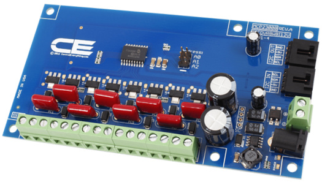
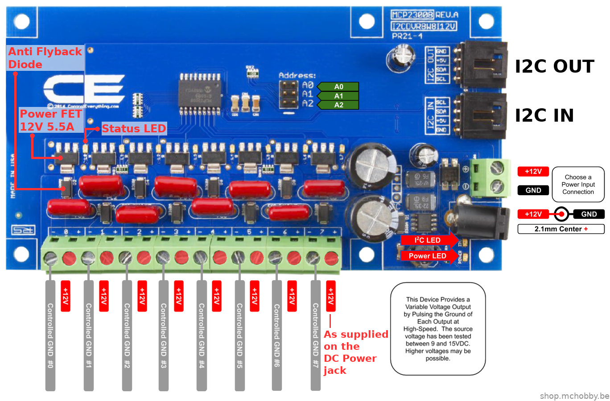
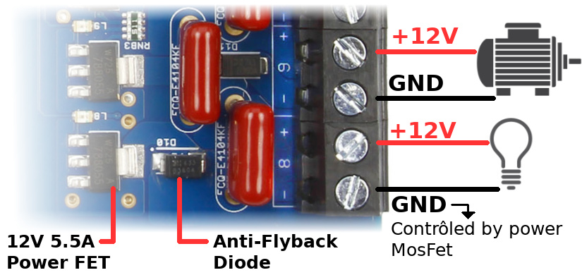
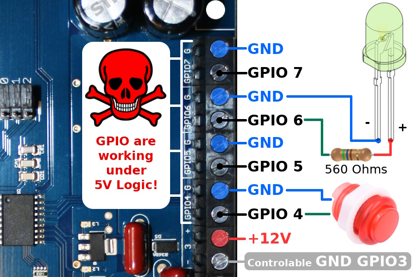
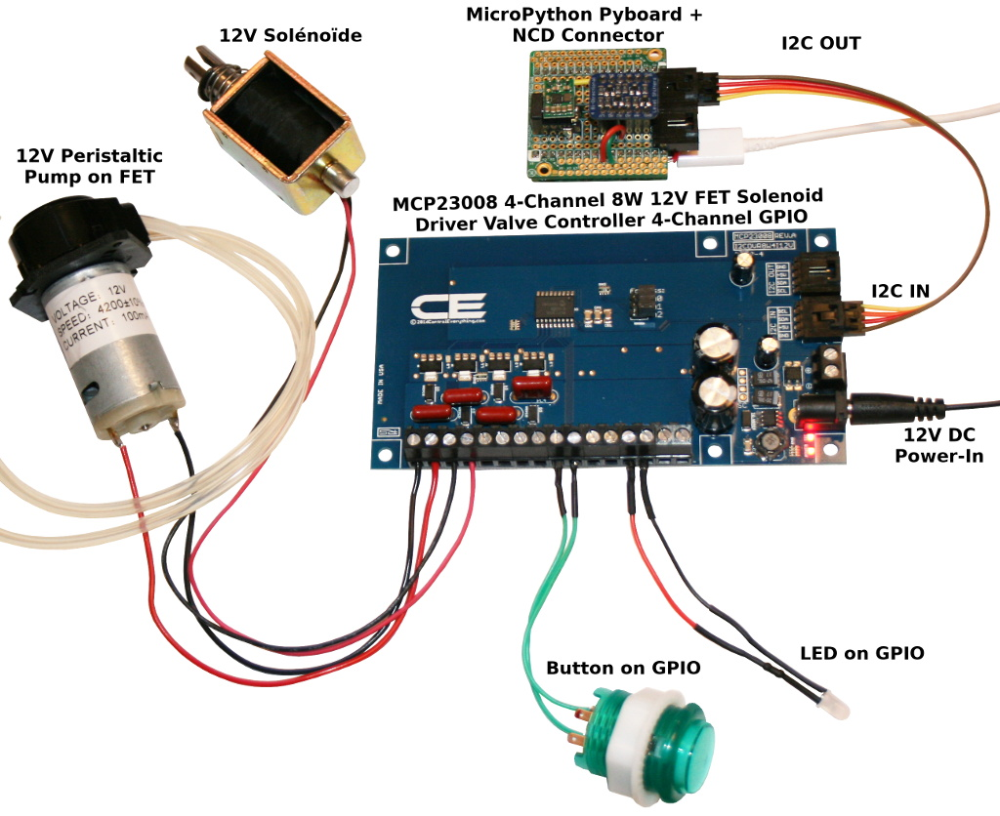

[This file also exists un ENGLISH](readme_ENG.md)

# Pilote de Solenoïdes à base de FET pour Valves (basé sur MCP23008)
Basé sur __MCP23008__ (I2C 8-bits GPIO extender, [datasheet](https://ww1.microchip.com/downloads/en/DeviceDoc/21919e.pdf), le __FET Solenoïd Driver Valve controller__ de [National Control Device](https://store.ncd.io) offre une façon simple e controler des charges résistives et charges inductives 12V comme des pompes, solénoïdes, gâche de porte, LEDs, moteurs, etc.

Cette carte I2C existe en deux modèles:
* [4 FET Solenoïd Drivers + 4 GPIOs](https://store.ncd.io/product/mcp23008-4-channel-8w-12v-fet-solenoid-driver-valve-controller-4-channel-gpio-with-i2c-interface/) sur ncd.io
* [8 FET Solenoïd Drivers](https://store.ncd.io/product/mcp23008-8-channel-8w-12v-fet-solenoid-driver-valve-controller-with-i2c-interface/) on ncd.io

## Contrôleur de solénoïdes FET 4 canaux + 4 GPIO


* [Contrôleur de solénoïdes FET 4 canaux + 4 GPIO](https://store.ncd.io/product/mcp23008-4-channel-8w-12v-fet-solenoid-driver-valve-controller-4-channel-gpio-with-i2c-interface/) sur ncd.io
* Contrôleur de puissance Marche/Arrêt, FET, 12V - avec interface I2C
* GPIO Programmable sur 4 canaux (logique 5V qui peut être utilisé en entrée ou en sortie)
* Contrôle de puissance sur 4 canaux (12V)
 * 4 canaux 12V en sortie prévu pour être utilisé avec des charges résistives ou inductives.
 * Offre un contrôle 12V de type marche/arrêt pour solénoïdes, vannes et moteur continu
 * Contrôle marche/arrêt pour éclairage 12V incandescent ou LEDs de puissance
 * Puissance de dissipation par canal : 8W
 * 4 Canaux type N BUK98150-55A __Fet de puissance 12V 5.5A__. [fiche technique BUK98150-55A](https://www.nexperia.com/products/mosfets/automotive-mosfets/BUK98150-55A.html)
* Port d'extension I2C pour ajouter des capteurs ou contrôleurs externes.
* GPIO extender I2C, MCP23008, 8 Canaux. [Fiche technique du MCP23008](https://ww1.microchip.com/downloads/en/DeviceDoc/21919e.pdf)

## Contrôleur de solénoïdes FET 8 canaux


* [Contrôleur de solénoïdes FET 8 canaux](https://store.ncd.io/product/mcp23008-8-channel-8w-12v-fet-solenoid-driver-valve-controller-with-i2c-interface/) on ncd.io
* Contrôleur de puissance Marche/Arrêt, FET, 12V - avec interface I2C
* Pas de GPIO extra disponible
* Contrôle de puissance sur 8 canaux (12V)
 * 8 canaux 12V en sortie prévu pour être utilisé avec des charges résistives ou inductives.
 * Offre un contrôle 12V de type marche/arrêt pour solénoïdes, vannes et moteur continu
 * Contrôle marche/arrêt pour éclairage 12V incandescent ou LEDs de puissance
 * Puissance de dissipation par canal : 8W
 * 8 Canaux type N BUK98150-55A __Fet de puissance 12V 5.5A__. [fiche technique BUK98150-55A](https://www.nexperia.com/products/mosfets/automotive-mosfets/BUK98150-55A.html)
 * Port d'extension I2C pour ajouter des capteurs ou contrôleurs externes.
 * GPIO extender I2C, MCP23008, 8 Canaux. [Fiche technique du MCP23008](https://ww1.microchip.com/downloads/en/DeviceDoc/21919e.pdf)

## Connecter des périphériques 12V

Les bornier FET propose une alimentation 12V + MASSE contrôlée par le FET. Cette interface peut être utilisé avec des charges résistives ou des charges inductives (bobines).





## Utiliser les GPIOs (disponibles en extra)

Les GPIOs peuvent être utilisés comme sortie (pour contrôler une LED) ou comme entrée (pour l'état d'un bouton) avec/sans résistance pull-up.

L'exemple ci-dessous montre:
* le GPIO6 utilisé comme sortie (OUTPUT) et branché sur une LED.
* le GPIO4 utilisé comme entrée (INPUT) avec la résistance PULL-UP ACTIVEE, entrée branchée sue un bouton.



# Raccordement

Il s'agit d'une carte I2C basée sur le connecteur NCD. Par conséquent, nous utilisons l'interface adéquate pour nous y connecter. Ce dépôt propose une interface NCD pour [MicroPython Pyboard](https://github.com/mchobby/pyboard-driver/tree/master/NCD) et [Modules ESP](../NCD/readme.md).




Notez que __National Control Device propose [des adaptateurs](https://store.ncd.io/shop/?fwp_product_type=adapters) __ pour de nombreuses plateformes de développement.

# Tester

Le script de test utilisera l'exemple de raccordement présenté ci avant avec les 4 canaux FETs et 4 canaux GPIO:
* Pompe à moteur 12V sur le GPIO 0
* Un solénoïde push-pull 12V sur le GPIO 1
* Une entrée bouton sur le GPIO 4 (résistance pull-up activée)
* LED en sortie sur GPIO 6

## Prérequis

Le fichier `mcp230xx.py` de la bibliothèque mcp230xx doit être disponible dans le path de recherche des bibliothèques.

La [bibliothèque mcp230xx est disponible ici](../mcp230xx/readme.md) sur ce GitHub.

## Bibliothèque et exemple

Copier la bibliothèque `fetsol.py` (pour la carte) et le fichier de test `test44.py` (4 canaux FET + 4 GPIOs) sur votre carte MicroPython.

Le fichier `test44.py` (listé ci-dessous) peut être chargé depuis une session REPL avec `import test44`.

```
from machine import I2C, Pin
from fetsol import FetSolenoid4
import time

# Créer le bus I2C en fonction de la plateforme.
# Pyboard: SDA sur Y9, SCL sur Y10.
#   Vitesse réduite à 100 Khz pour réaliser des test.
i2c = I2C( 2, freq=100000 )
# Feather ESP8266 & Wemos D1: sda=4, scl=5.
# i2c = I2C( sda=Pin(4), scl=Pin(5) )
# ESP8266-EVB
# i2c = I2C( sda=Pin(6), scl=Pin(5) )

# Ajouter le paramètre "address" si nécessaire (0x20 par défaut)
board = FetSolenoid4( i2c )

# Activer les sorties FETs
for i in range(4):
	board.output( i, True )
	time.sleep( 1 )

# désactiver les 4 sorties en deux étapes
board.output_pins( {0: False, 2: False } )
time.sleep( 1 )
board.output_pins( {1: False, 3: False } )
time.sleep( 1 )

# Utiliser un dictionnaire pour modifier l'état de plusieurs broches
dic = {}
dic[2] = True
dic[3] = True
board.output_pins( dic )
time.sleep( 1 )

# Reset de tous les FETs
board.reset()

# --------------------------------------------
#   Manipuler les GPIOs
# --------------------------------------------
# Configurer le GPIO 6 en sortie (output)
board.setup( 6, Pin.OUT )
board.output( 6, True )

# Configurer le GPIO 4 en entrée (input) + activer la pull-up
board.setup( 4, Pin.IN )
board.pullup( 4, True )
# Faire 10x la lecture de l'entrée
for i in range( 10 ):
	print( "GPIO 4 = %s" % board.input(4) )
	time.sleep( 1 )

# Désactiver le GPIO 6
board.output( 6, False )
```
Voir aussi l'exemple `test8.py` qui manipule les 8 sorties FETs de la carte.
