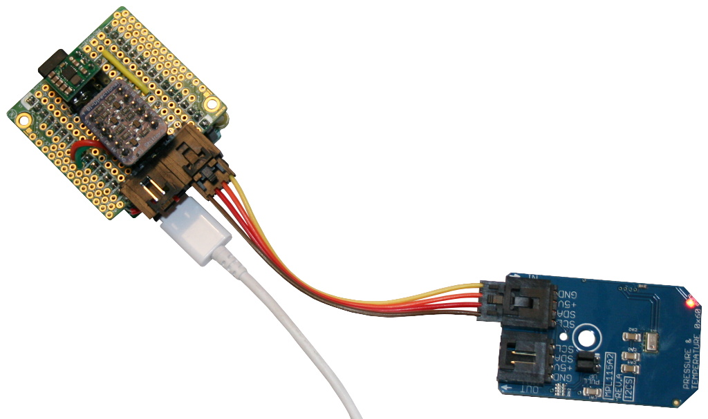
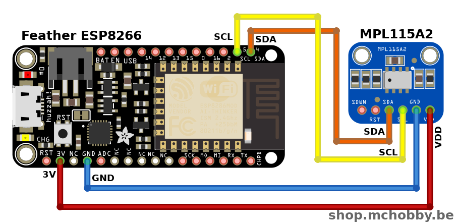
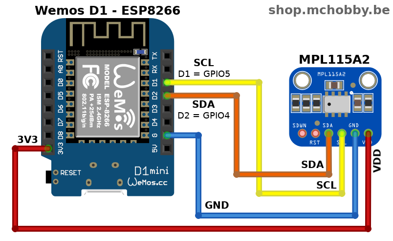
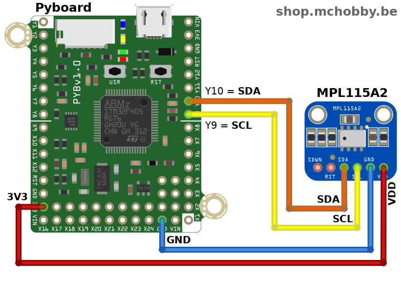

[This file also exists in ENGLISH here](readme_ENG.md)

# Mesurer la pression athmosphérique et le température avec le capteur MPL115A2

Le MPL115A2 de Freescale utilise le senseur de pression MEMS avec une interface I2C pour fournie une mesure précise de Pression/Altitude et Temperature.

Les sorties du capteur sont numérisées à l'aide d'un convertisseur ADC haute résolution (en 24-bits). Il est capable de détecter un changement de de seulement 0.05 kPa, ce qui correspond à un changement d'altitude d'environ 0.3m.
* Altimètre I2C avec convertisseur ADC 24-Bits
* Fonctionne avec la gamme de pression de 50 kPa~115 kPa (50 millibar à 1150 millibar)
* Totalement compensé (en interne)
* Evénements programmable
* Log de données jusqu'à 12 jours
* Conforme RoHS
* Adresse I2C: 0x60

Ce senseur est disponible sous forme de breakout et comme mini carte NCD (plus facile à brancher).


Application typique du MPL115A2:
* Altimètre électronique personnel,
* Equipement de station météo,
* Assistant de Navigation,
* HVAC, conditionnement d'air, etc.

## A propos des modules NCD
Les mini modulesI2C de NCD National Control Device / ncd.io sont conçu avec un connecteur standard à 4 broches très pratique. Grâce à ces connecteurs, plus besoin de souder et les modules peuvent être chaînés sur un bus I2C.

Ce module NCD MPL115A2 n'a pas besoins de level shifter et de régulateur de tension puisqu'il est capable de fonctionner avec une tension d'alimentation de 2.4V à 5.5V.

# Brancher

## Brancher une carte NCD

C'est un capteur I2C sur un connecteur NCD, il peut donc être utilisé avec l'interface adéquate. Ce dépôt propose une interface NCD pour [MicroPython Pyboard](https://github.com/mchobby/pyboard-driver/blob/master/NCD/README.md) et [modules ESP](../NCD/readme.md).




Notez que __National Control Device propose [de nombreux adaptateurs](https://store.ncd.io/shop/?fwp_product_type=adapters) __ pour de nombreuses cartes de développement.

## Raccorder avec un breakout (Feather, Wemos, Pyboard)







# Tester
copier le fichier `mpl115a2.py` et `test.py` sur votre carte pyboard.

Le fichier `test.py` (listé ci-dessous) peut être chargé depuis une session REPL à l'aide de `import test`

```
from machine import I2C, Pin
from mpl115a2 import MPL115A2
import time

# Créer le bus I2C en adéquation avec votre plateforme.
# Pyboard: SDA sur Y9, SCL sur Y10. Voir le câblage NCD sur https://github.com/mchobby/pyboard-driver/tree/master/NCD
#         Freq par défaut 400000 = 400 Khz est trop élevé.
#         N'hésitez pas à la réduire à 100 Khz. N'hésitez pas à le tester à 10 KHz (10000)
i2c = I2C( 2, freq=100000 )
# Feather ESP8266 & Wemos D1: sda=4, scl=5.
# i2c = I2C( sda=Pin(4), scl=Pin(5) )
# ESP8266-EVB
# i2c = I2C( sda=Pin(6), scl=Pin(5) )

mpl = MPL115A2( i2c )
print( 'raw_values ', mpl.raw_values ) # Valeur brute de pression, temp
val = mpl.values # Valeurs "Human Friendly"
print( val[0] ) # pression hPa
print( val[1] ) # température °C

while True:
	print( '%-15s %-15s' % mpl.values )
	time.sleep(1)
```

Ce qui produit les résultats suivants:

```
raw_values  (1010.17, 20.3271)
1011.71hPa
20.3271C
1010.59hPa      20.51402C      
1010.17hPa      20.3271C       
1011.71hPa      20.3271C       
1012.12hPa      20.51402C      
1011.71hPa      20.3271C       
1012.12hPa      20.51402C
...
```

# Où acheter
* NCD-MPL115A2 : http://shop.mchobby.be/
* NCD-MPL115A2 : https://store.ncd.io/product/mpl115a2-digital-barometer-50-to-115-kpa-i2c-mini-module/
* MPL115A2 breakout : https://shop.mchobby.be/fr/nouveaute/1587-mpl115a2-is-an-i2c-pressure-and-temperature-sensor-3232100015876.html
