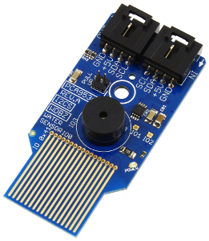
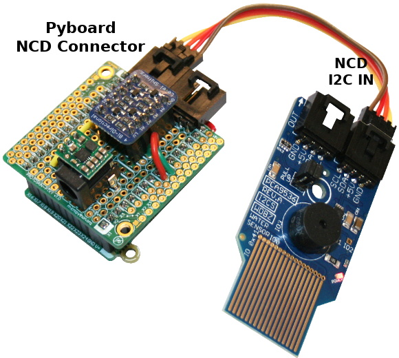

[Ce fichier existe également en FRANCAIS](readme.md)

# Water Detection Sensor with Buzzer (PCA9536 based)

The water detection sensor (with buzzer) can be used to detect water or liquid leakage.



The water detect lines are connected to the GPIO IO0. The IO0 get connected to ground when water is detected (Low: Water Detected, High: No Water Present).  

The on-board buzzer is connected to the GPIO IO3 (set to high to activate the buzzer).

The IO2 & IO3 are still available on the board.

Main features:
* Based on __PCA9536__ (I2C 4-bits GPIO extender, [datasheet](https://media.ncd.io/sites/2/20170721134419/PCA9536-5.pdf) )
* I2C Water Detection Sensor
* 4.41 cm²  Detection Area
* On Board I2C Buzzer for Alarm Applications
* 2 Extra GPIO Pads for External Use (IO1 & IO2)

This sensor is available as NCD Mini board (easier to wire).


# Wiring

It is a I2C sensor based on NCD connector, so use the appropritate interface to connect it. This repository propose NCD interface for [MicroPython Pyboard](https://github.com/mchobby/pyboard-driver/blob/master/NCD/README.md) and [ESP modules](../NCD/readme.md).




Notice that __National Control Device propose [many adapter board](https://store.ncd.io/shop/?fwp_product_type=adapters) __ for many development plateform.

# Testing

## Prerequisite

The file `pca9536.py` from the PCA9536 library must be available on the library search path.

The [pca9536 library is available here](../pca9536/readme.md) on this github.

## library & examples

Copy the file `wdetect.py` and `wdtest.py` on your MicroPython board.

The `wdtest.py` file (listed here under) can be loaded from REPL session with `import wdtest`.

That example test the basic functionnality of the Water Detector by activating the buzzer as long as sensor detects water.

```
from machine import Pin, I2C
from time import sleep
from wdetect import WaterDetect

# Create the I2C bus accordingly to your plateform.
# Pyboard: SDA on Y9, SCL on Y10. See NCD wiring on https://github.com/mchobby/pyboard-driver/tree/master/NCD
#          Bus speed has beed reduced to 100 Khz for convenience. Do not hesitate to test with 10 KHz (10000)
i2c = I2C( 2, freq=100000 )
# Feather ESP8266 & Wemos D1: sda=4, scl=5.
# i2c = I2C( sda=Pin(4), scl=Pin(5) )
# ESP8266-EVB
# i2c = I2C( sda=Pin(6), scl=Pin(5) )

wd = WaterDetect( i2c )
buz = False
try:
	while True:
		if wd.has_water:
			print( "WATER DETECTED!" )
			# Call the set buzzer ONLY ONCE to not load the I2C bus
			if not buz:
				buz = True
				wd.buzzer( True )
		else:
			print( '...')
			# Call the set buzzer ONLY ONCE to not load the I2C bus
			if buz:
				buz = False
				wd.buzzer( False )
		sleep( 1 )
finally:
	# be sure than buzzer is deactivated
	# ... before someone get crazy
	if buz:
		wd.buzzer( False )
```

This second example shows how to control the 2 extra GPIO (IO1 and IO2) still available on the Water Detector Board


```
from machine import Pin, I2C
from time import sleep
from wdetect import WaterDetect

# Create the I2C bus accordingly to your plateform.
# Pyboard
i2c = I2C( 2, freq=100000 )
# Feather ESP8266 & Wemos D1: sda=4, scl=5.
# i2c = I2C( sda=Pin(4), scl=Pin(5) )
# ESP8266-EVB
# i2c = I2C( sda=Pin(6), scl=Pin(5) )

wd = WaterDetect( i2c )
wd.setup( 1, Pin.IN  ) # IO1 as Input
wd.setup( 2, Pin.OUT ) # IO2 as Output

while True:
	val = wd.input( 1 )
	print( "IO1 -> %s" % val )

	# activate the IO2 when water is detected
	wd.output( 2, wd.has_water )
	sleep( 1 )
```
