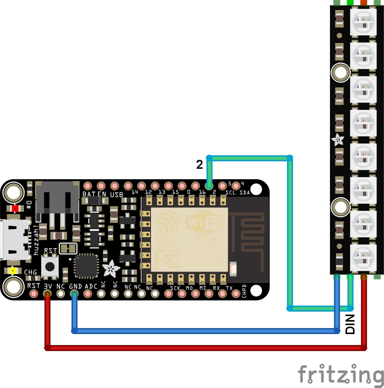
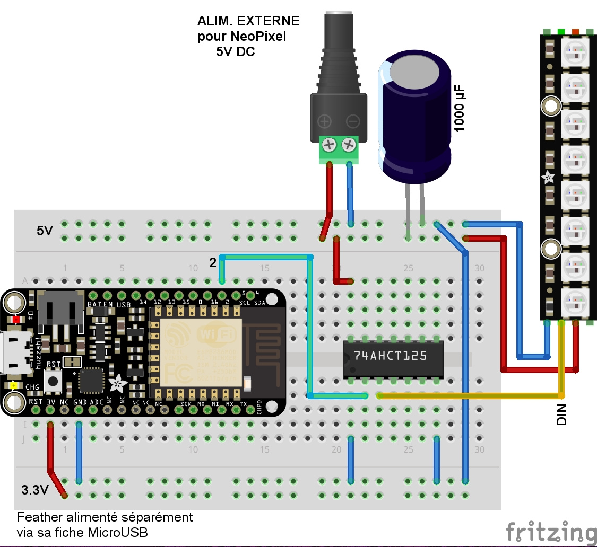

# Utilisation de NeoPixel et ESP8266 MicroPython

* Shop: [Gamme NeoPixel](https://shop.mchobby.be/55-leds-neopixels-et-dotstar)
* Shop: [NeoPixel Stick](https://shop.mchobby.be/leds-neopixels-et-dotstar/407-stick-neopixel-8-leds-rgb--3232100004078-adafruit.html) utilisé dans cet exemple.
* Wiki: https://wiki.mchobby.be/index.php?title=MicroPython-Accueil#ESP8266_en_MicroPython

# Attention: Utiliser des NeoPixels Récents
La bibliothèque incluse dans le firmware microPython prend en charge génération de NeoPixel avec flux de donnée de 800 KHz.

Le bibliothèque __ne prend pas en charge__:
* l'ancienne génération de NeoPixel (flux de donnée à 400 KHz)
* les LEDs NeoPixel RGBW.

# Raccordement
## NeoPixel sous 3.3V



| Broche ESP8266 | Broche  NeoPixel | Note                                                                                                       |
|----------------|------------------|------------------------------------------------------------------------------------------------------------|
| GND            | GND              |                                                                                                            |
| 3V             | 5V               | Neopixel fonctionne également sous 3.3V. Juste moins brillant. Attention le signal doit aussi être en 3.3V |
| 2              | DIN              | Le signal doit entrer par la broche Data IN (ne pas se tromper avec Data OUT)                              |

## NeoPixel sous 5V

Il est possible d'alimenter les NeoPixels sous 5V afin d'avoir des couleurs vives et stables en toutes circonstances.

Il faut absolument utiliser un [Level Shifter 74AHCT125](http://df.mchobby.be/datasheet/74AHC125.pdf) (pdf) aussi que le signal de commande des NeoPixel soit en 5V. 



## Broches compatibles

Nous avons testé la bibliothèque NeoPixel sur les broches suivantes de l'ESP8266:

| Broche | Compatibilité |
|---|---|
| __14__ | NeoPixel compatible. |
| __12__ | _non testé._ |
| __13__ | NeoPixel compatible. |
| __15__ | NeoPixel compatible. |
| __0__  | __NE PAS UTILISER__. Broche de boot. |
| __16__ | __NON FONCTIONNEL__ pour NeoPixel |
| __2__  | NeoPixel compatible. |
| __5__  | NeoPixel compatible. Bus I2C (SCL) |
| __4__  | NeoPixel compatible. Bus I2C (SDA) |

# Code de test

```
# Utilisation de la bibliothèque neopixel avec Feather ESP8266 
# sous MicroPython
#
# Shop: https://shop.mchobby.be/55-leds-neopixels-et-dotstar
# Wiki: https://wiki.mchobby.be/index.php?title=MicroPython-Accueil#ESP8266_en_MicroPython

from machine import Pin
from neopixel import NeoPixel
from time import sleep

# NeoPixel( broche_signal, nbre_de_led )
np = NeoPixel( Pin(2), 8 )

# Fixer la couleur la couleur du premier pixel
# avec un tuple (r,g,b) ou chaque valeur est 
# située entre 0 et 255
np[0] = (255,0,0) # rouge

# couleur des autres pixels
np[1] = (0, 255, 0) # vert
np[2] = (0, 0, 128) # bleu (1/2 brillance)

# Voir aussi HTML Color Picker
# https://www.w3schools.com/colors/colors_picker.asp
np[3] = (255, 102, 0) # Orange
np[4] = (255, 0, 102) # Rose bonbon
np[5] = (153, 51, 255) # Violet
np[6] = (102, 153, 255) # bleu pastel
np[7] = (153, 255, 153) # vert pastel

# Envoyer l'info au NeoPixels
np.write()

sleep(2)

# fill() permet de remplir tout
# le NeoPixel avec une seule couleur
colors = [ (255,0,0), (0, 255, 0), (0, 0, 128),
    (255, 102, 0) , (255, 0, 102), (153, 51, 128), 
    (102, 153, 128), (153, 255, 128) ]

for color in colors:
    np.fill( color )
    np.write()
    sleep(2)

# Eteindre les NeoPixels
np.fill( (0,0,0) )
np.write()
```

## Couleur bleue et 3.3V
La couleur bleue est difficile à produire sous 3.3V.

Par conséquent, `np.write( (0,0,255) )` ne produit pas vraiment de couleur. 

C'est parce que le Forward Voltage d'une LED bleue est d'environ 2.8V (typiquement 3.2V). Avec une source d'alimentation de 3.3V, le tension est un peu faible pour activer une led bleue. Nous sommes à la limite pour pouvoir produire du Bleu. 

Il est parfois plus efficace de produire un bleu en mi-brillances avec `np.write( (0,0,128) )` ou bleu en quart-de-brillance avec `np.write( (0,0,64) )` 

__Limite du régulateur de tension:__

De même, nous avons remarqué que le régulateur de tension d'un ESP8266 ne produit pas vraiment assez de courant pour l'ESP8266 + le contrôler de 8 LEDs NeoPixels. Par conséquent l'utilisation d'une alimentation externe 3.3v pour alimenter les NeoPixels est le bienvenue. 

Ne pas oublier d'avoir une masse commune (référentiel de tension) entre l'alimentation NeoPixel et l'ESP8266.

A noter que si le régulateur de tension peine à founir le courant nécessaire alors sa tension chutera un peu (de 3.3v à 3.1v), ce qui aura pour effet de produire un effet de scintillement sur les LEDs.

__Utiliser le régulateur de l'ESP8266:__

Le régulateur de la plateforme ESP8266 sera néanmoins suffisant pour commander quelques NeoPixels. Dans ce cas, il est préférable de:
* ne pas êtres pas trop exigeant sur la qualité des couleurs (utiliser des couleurs en mi-brillance)
* s'attendre à des scintillements lors d'un charge plus importante en courant (lorsque l'on affiche du blanc ou des couleurs vive).

# Source et ressources
* Référence officielle NeoPixel sous ESP8266: http://docs.micropython.org/en/v1.8.2/esp8266/esp8266/tutorial/neopixel.html

