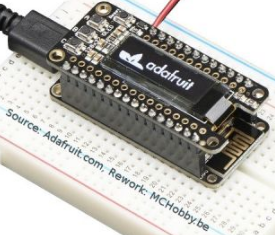
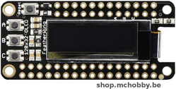
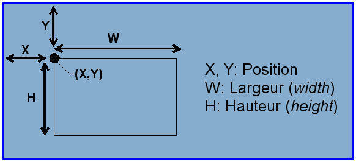

# Utilisation d'écran OLED ssd1603 et ESP8266 MicroPython

MicroPython permet d'utiliser très facilement un écran OLED I2C basé sur le contrôleur ssd1306.

Ce GitHub couvre plusieurs modèles de cartes sous MicroPython: 
* [Feather ESP8266](https://shop.mchobby.be/product.php?id_product=846) + [OLED FeatherWing](https://shop.mchobby.be/product.php?id_product=879)

## Produit
* Shop: [OLED 128x32 FeatherWing](https://shop.mchobby.be/feather/879-feather-ecran-oled-3232100008793-adafruit.html)
* Shop: [Feather ESP8266](https://shop.mchobby.be/feather/846-feather-huzzah-avec-esp8266-3232100008465-adafruit.html) utilisé dans cet exemple.
* Wiki: https://wiki.mchobby.be/index.php?title=MicroPython-Accueil#ESP8266_en_MicroPython

# Brancher 
## OLED Featherwing
Le FeatherWing OLED s'insère simplement sur la carte Feather (ex: Feather ESP8266) et propose une résolution de 128 x 32 pixels. 



# Code de test
Dans tous les cas de figure, l'écran OLED sera créé sous la référence __lcd__ .
## Créer LCD
### pour FeatherWing OLED

 

```
# Utilisation de la bibliothèque ssd1306 avec Feather ESP8266 
# sous MicroPython
#
# Shop: https://shop.mchobby.be/feather/879-feather-ecran-oled-3232100008793-adafruit.html
# Wiki: https://wiki.mchobby.be/index.php?title=FEATHER-MICROPYTHON-OLED

from machine import Pin, I2C
i2c = I2C( sda=Pin(4), scl=Pin(5) )
import ssd1306
lcd = ssd1306.SSD1306_I2C( 128, 32, i2c )
```

## Tester la bibliothèque
Dans les exemples ci-dessous, voici les paramètres que vous retrouverez dans les différents appels de fonction: 


* __x__ : position du point par rapport au côté gauche de l'écran.
* __y__ : position du point par rapport au dessus de l'écran.
* __w__ : largeur (du mot Width).
* __h__ : hauteur (du mot Height).
* __c__ : __couleur (1=point allumé, 0=point éteint)__


# Source et ressources
* [Voir le Wiki MC Hobby](https://wiki.mchobby.be/index.php?title=FEATHER-MICROPYTHON-OLED)
