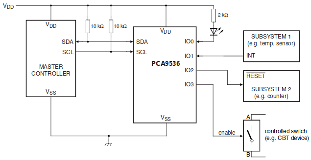

[This file also exists in ENGLISH](readme_ENG.md)

# PCA9536 - Extension GPIO 4 Bits, bus I2C


Le PCA9536 est un composant à 8 broches (tolérant 5V) qui offre un GPIO (General Purpose parallel Input/Output) sur 4 bits.

Le PCA9536 est utilisé comme interface I2C sur certaines cartes d'extension. Cette section du GitHub ne contient que le pilote et quelques exemples.

Vous trouverez ci-dessous un exemple d'utilisation du PCA9536.



__Le PCA9536 a une fonctionnalité très particulière__ avec une résistance pull-up interne de 100 kΩ (non désactivable!) sur les broches d'entrées.

La fonctionnalité "_power-on_" initialise les registres et leurs valeurs par défaut et initialise la machine a état fini.

Caractéristiques principales:
* [fiche technique du PCA9536](https://www.nxp.com/products/analog/interfaces/ic-bus/ic-general-purpose-i-o/4-bit-i2c-bus-and-smbus-i-o-port:PCA9536)
* GPIO 4-bits sur I2C (fréquence d'horloge de 0 Hz à 400 kHz)
* Tension d'alimentation de l'ordre de 2.3 V à 5.5 V
* I/O tolérant 5V
* Registre d'inversion de polarité (_Polarity Inversion register_)
* Faible courant en mode veille
* Pas de parasite à la mise sous tension
* _Power-on reset_ interne
* 4 broches I/O pins configurée par défaut en 4 entrées avec résistance pull-up interne de 100 kΩ.
* Protection ESD protection excédent 2000 V
* Latch-up testing is done to JEDEC Standard JESD78 which exceeds 100 mA

# Testing code

```
from pca9536 import PCA9536
from machine import Pin, I2C
from time import sleep

# Créer le bus I2C en fonction de votre plateforme.
# Pyboard: SDA sur Y9, SCL sur Y10.
#         Freq par défaut du bus 400000 = 400 Khz est trop haute.
#         A réduire à 100 Khz. Ne pas hésiter à tester à 10 KHz (10000)
i2c = I2C( 2, freq=100000 )
# Feather ESP8266 & Wemos D1: sda=4, scl=5.
# i2c = I2C( sda=Pin(4), scl=Pin(5) )
# ESP8266-EVB
# i2c = I2C( sda=Pin(6), scl=Pin(5) )

pca = PCA9536( i2c )

# Mettre IO0 en entrée - pull-up matériel activé par défaut sur toutes les broches
pca.setup( 0, Pin.IN  )
# Mettre IO1 en entrée
#	Résultat de lecture = False lorsque la broche est HIGH (non connectée sur la masse)
#	Résultat de lecture = True  lorsque la broche est LOW  (    connectée sur la masse)
pca.setup ( 1, Pin.IN )

# Mettre IO3 en sortie
pca.setup( 3, Pin.OUT )
pca.output( 3, False )  # HIGH par défautn placer au niveau bas
for i in range( 2 ):
	# Astuce: voir output_pins() pour modifier plusieurs broches
	pca.output( 3, True )
	sleep( 1 ) # 1 Seconde
	pca.output( 3, False )
	sleep( 1 )

# Lire valeur sur GPIO 0 - pull-up activée par défaut
for i in range( 10 ):
	# Astuce : see input_pins() pour lire plusieurs broches
	print( "IO0 = %s" % (pca.input(0)) )
	sleep( 1 )

# Lire la valeur sur GPIO 1 - pull-up activée par défaut
for i in range( 10 ):
	# Astuce : see input_pins() pour lire plusieurs broches
	print( "IO1 = %s" % (pca.input(1)) )
	sleep( 1 )
```
